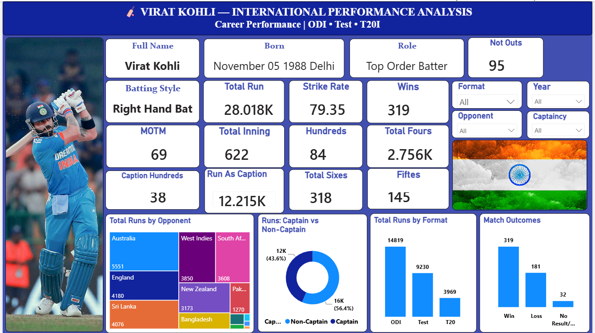

# 🏏 Virat Kohli — International Performance Analysis

An interactive **Power BI dashboard** analyzing Virat Kohli's international cricket performance across **ODI, Test, and T20I formats**.

The project transforms raw cricket match data into an interactive analytical dashboard using **Python, Power Query, DAX, and Power BI**.

---

## 📊 Dashboard Preview



---

## 📌 Project Overview

This project analyzes Virat Kohli's international batting performance using match-level cricket data.

The dashboard provides an interactive view of his career performance across different formats, years, opponents, and captaincy status.

It combines career KPIs with opponent analysis, captaincy comparison, format-wise performance, and match outcomes in a single Power BI dashboard.

---

## 🎯 Project Objectives

- Analyze Virat Kohli's international batting performance
- Compare performance across ODI, Test, and T20I formats
- Analyze runs scored against different opponents
- Compare runs as Captain vs Non-Captain
- Analyze match outcomes
- Track important career batting KPIs
- Build dynamic filtering using interactive Power BI slicers
- Transform raw JSON cricket data into an analysis-ready dataset

---

## 📊 Dashboard KPIs

The dashboard includes the following performance indicators:

- 🏏 Total Runs
- ⚡ Strike Rate
- 🏟️ Total Innings
- 💯 Hundreds
- 5️⃣0️⃣ Fifties
- 4️⃣ Total Fours
- 6️⃣ Total Sixes
- ⭐ Player of the Match (MOTM)
- 🏆 Wins
- 🛡️ Not Outs
- 👑 Captain Hundreds
- 👑 Runs as Captain

The dashboard also displays player information including:

- Full Name
- Date of Birth
- Role
- Batting Style

---

## 📈 Dashboard Visualizations

### 🌍 Total Runs by Opponent

A treemap showing Virat Kohli's total runs against different international opponents.

This visual helps identify the teams against which he has accumulated the most runs.

### 👑 Captain vs Non-Captain

A donut chart comparing runs scored while playing as:

- Captain
- Non-Captain

This provides an interactive comparison of his batting contribution under different leadership roles.

### 🏏 Total Runs by Format

A column chart comparing total runs across:

- ODI
- Test
- T20I

### 🏆 Match Outcomes

A column chart showing match results such as:

- Wins
- Losses
- No Result / Other outcomes

---

## 🎛️ Interactive Filters

The dashboard contains four interactive slicers:

- **Format**
- **Year**
- **Opponent**
- **Captaincy**

These filters dynamically update the KPI cards and visualizations, allowing users to explore specific portions of Kohli's international career.

---

## 🧮 Important DAX Measures

### Total Runs

```DAX
Total Runs =
SUM(Kohli_Performance[Runs])
```

### Strike Rate

```DAX
Strike Rate =
DIVIDE(
    SUM(Kohli_Performance[Runs]) * 100,
    SUM(Kohli_Performance[Balls])
)
```

### Total Innings

```DAX
Total Innings =
COUNTROWS(Kohli_Performance)
```

### Total Fours

```DAX
Total Fours =
SUM(Kohli_Performance[Fours])
```

### Total Sixes

```DAX
Total Sixes =
SUM(Kohli_Performance[Sixes])
```

---

## 🛠️ Tools & Technologies

| Tool / Technology | Purpose |
|---|---|
| **Power BI** | Dashboard development and interactive visualization |
| **Power Query** | Data cleaning and transformation |
| **DAX** | KPI calculations and analytical measures |
| **Python** | Processing and extracting data from JSON files |
| **CSV** | Analysis-ready cleaned dataset |
| **JSON** | Original match-level source data |

---

## 🔄 Project Workflow

```text
Cricsheet JSON Match Data
           ↓
     Python Extraction
           ↓
    Data Transformation
           ↓
      Data Cleaning
           ↓
   Master CSV Dataset
           ↓
      Power Query
           ↓
      DAX Measures
           ↓
    Power BI Dashboard
```

---

## 📂 Dataset

The project uses international cricket match data from **Cricsheet**.

The original match data was available in JSON format. Python was used to process the match files and extract Virat Kohli's batting and match-level information into a structured CSV dataset.

The cleaned dataset contains analytical fields such as:

- Match ID
- Date
- Year
- Format
- Opponent
- Venue
- City
- Runs
- Balls
- Fours
- Sixes
- Strike Rate
- Batting Position
- Dismissal
- Not Out
- Match Result
- Captaincy
- Player of the Match

---

## ⚠️ Dataset Limitation

This analysis is based on the **available Cricsheet India match dataset** used during the project.

The downloaded Cricsheet archive states that certain matches were withheld under Cricsheet's policy concerning matches involving the Afghanistan men's team or the Afghanistan Premier League.

As a result, some aggregate statistics in this dashboard may differ from complete career statistics published by other cricket statistics providers.

Missing career statistics were **not manually inserted or adjusted** simply to force the dashboard totals to match another source.

This keeps the dashboard calculations consistent with the underlying dataset used for the analysis.

---

## 📁 Repository Structure

```text
Virat-Kohli-Performance-Analysis/
│
├── README.md
├── Virat_Kohli_Performance_Analysis.pbix
├── Virat_Kohli_Performance_Master_Cleaned.csv
└── virat-kohli-dashboard.png
```

### File Description

| File | Description |
|---|---|
| `Virat_Kohli_Performance_Analysis.pbix` | Complete interactive Power BI dashboard |
| `Virat_Kohli_Performance_Master_Cleaned.csv` | Cleaned dataset used for analysis |
| `virat-kohli-dashboard.png` | Final dashboard preview |
| `README.md` | Complete project documentation |

---

## 💡 Key Learnings

Through this project, I strengthened my practical skills in:

- Data Cleaning
- Data Transformation
- Data Validation
- JSON Data Processing
- Python
- Power Query
- DAX
- KPI Development
- Interactive Dashboard Design
- Data Visualization
- Sports Data Analytics
- Data Storytelling

---

## 👤 Author

**Rahul Shewale**

Aspiring Data Analyst  
**Power BI | SQL | Excel | Tableau | Python**

---

⭐ If you found this project interesting, feel free to explore the dashboard and repository.
